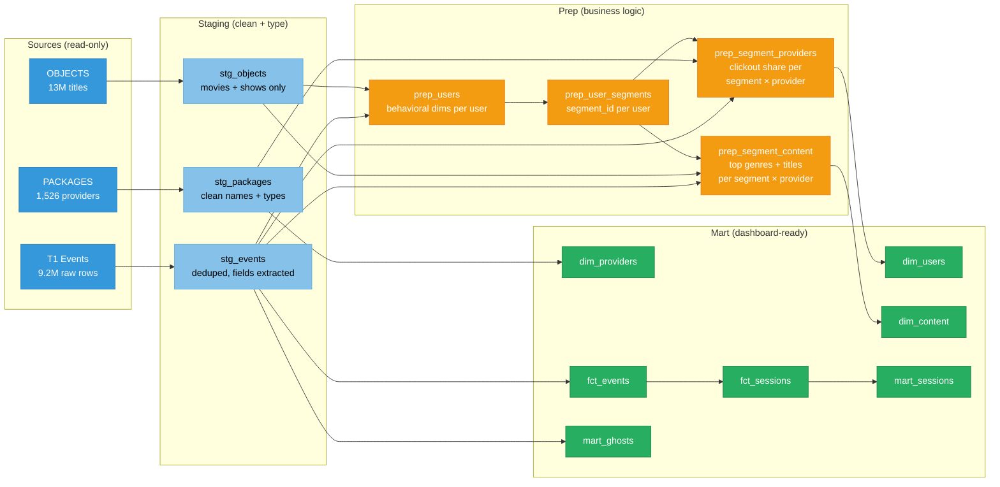
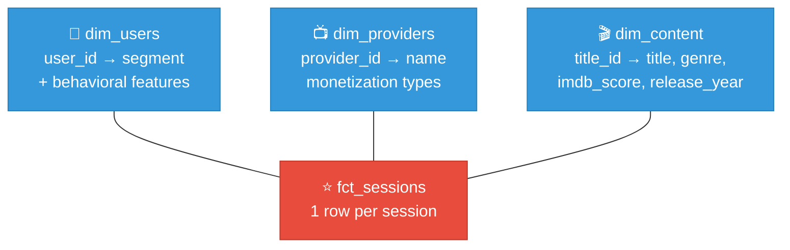
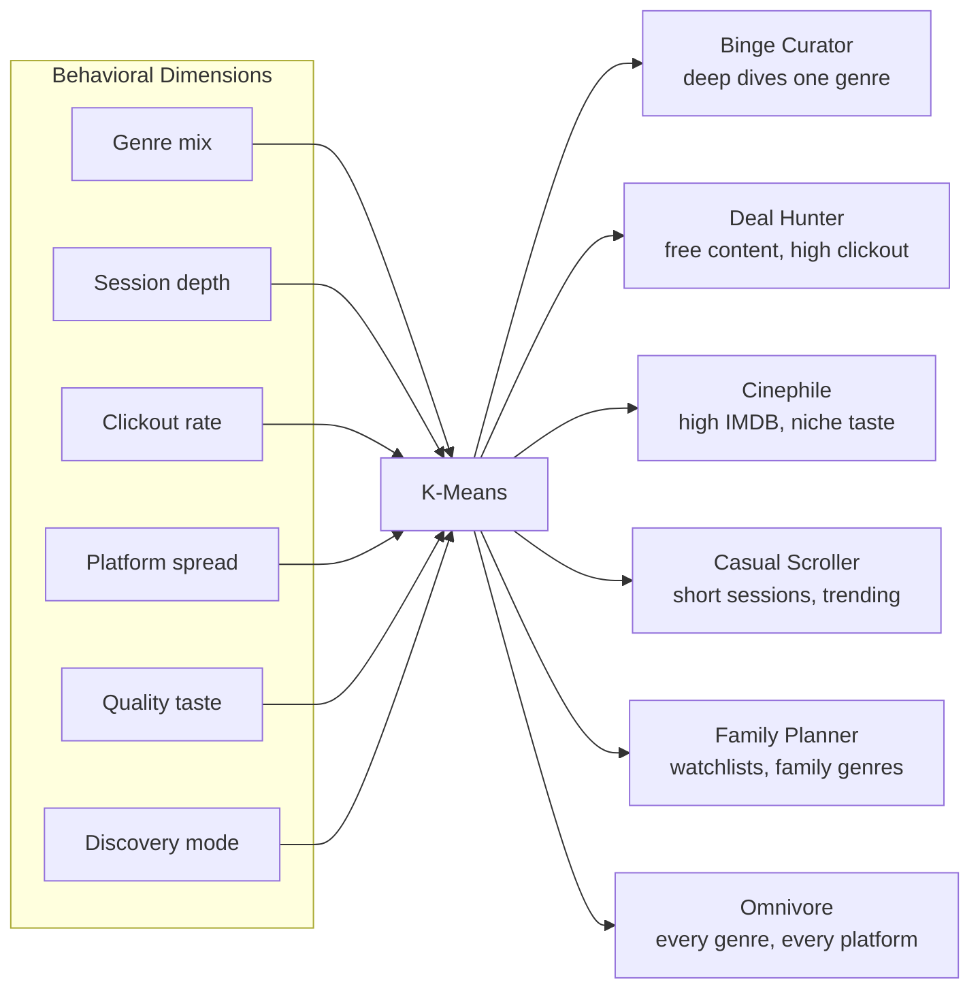
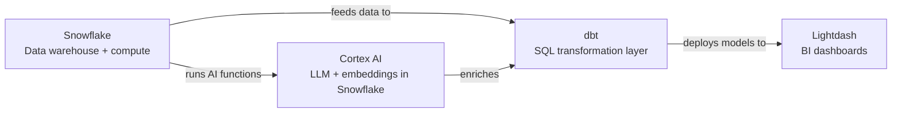

# Snowflake Streaming Intelligence

A streaming audience intelligence platform built on Snowflake, dbt, Lightdash, and Cortex AI. It segments users by behavioral patterns, maps those segments to streaming providers, and surfaces content gaps — telling providers which audiences they're losing and what content would win them back.

## What it does

Raw clickstream data from JustWatch (page views, searches, clickouts, watchlist actions) is transformed into three actionable insights for streaming platform content buyers:

1. **Where you're strong** — which user segments prefer your platform
2. **Where you're losing** — which segments go to competitors and by how much
3. **What to acquire** — content gaps ranked by demand from segments you're losing

## Development setup

1. Create a Python virtual environment
```bash
uv venv && source .venv/bin/activate
```
2. Install dependencies
```bash
uv pip install -r requirements.txt
```
3. Copy `.env.example` to `.env` and fill in your Snowflake credentials
4. Load environment variables
```bash
source .env
```
5. Verify your dbt connection
```bash
cd platforms/dbt/dbt_template
dbt debug
```
6. Deploy to Lightdash
```bash
lightdash deploy --select staging mart prep
```

---

## Problem

JustWatch has millions of users clicking, searching, and browsing every day. The raw data alone can't answer:

- What types of viewers actually exist? (Not age/gender — actual behavior)
- What does each type want to watch?
- Which providers are missing content that specific user groups want?

## Solution

Users are grouped by behavior (binge watchers, bargain hunters, cinephiles, etc.). For each group, the platform maps what they watch on which provider — and where the gaps are.

The core insight: if a user cluster searches for sci-fi on Netflix but can't find it, while watching sci-fi on Amazon Prime — that's a gap recommendation:

> *"Netflix, you're losing Sci-Fi Binge Watchers to Amazon Prime. They're searching for this content on your platform but can't find it. Here's what to add."*

## Output

A dashboard built for a content buyer at a streaming platform. They select their platform and see:

- Which user segments they own — "You have 40% of Cinephiles"
- Which user segments they're losing — "Deal Hunters prefer Amazon Prime 3:1 over you"
- What content would win them back — "These genres are in high demand from segments you're losing, and your competitors have them"

```
Raw clicks → Group by behavior → Map segments to providers → Find gaps per provider → "Here's what you're missing"
```

---

## Dashboard Design


Global filter at top: select your platform. Everything below is relative to that provider.

Three sections, one story: Strengths → Weaknesses → What to buy.

---

### Section 1: "Where you're strong"

**Core metric**: Segment share — % of each user segment whose clickouts go to the selected provider.

| Chart type | What it shows |
|:-----------|:-------------|
| Horizontal bar chart (one bar per segment) | "Netflix: Cinephiles 40%, Family 35%, Casual 28%, Deal Hunters 8%" |
| Grouped bar chart (selected vs. top competitor) | Side-by-side: "Cinephiles: Netflix 40% vs MUBI 22%" |
| Radar/spider chart | Provider's audience footprint — spiky = niche, round = broad |
| Segment heatmap (segments × providers) | Full competitive landscape at a glance |

---

### Section 2: "Where you're losing"

**Core metric**: Competitive gap — for segments where the selected provider is not #1, show who's winning and by how much.

| Chart type | What it shows |
|:-----------|:-------------|
| Diverging bar chart | "You lead Cinephiles by +18pp, trail Deal Hunters by -30pp" |
| Stacked bars per weak segment | "Deal Hunters: Amazon 38%, Tubi 22%, Pluto 18%, Netflix 8%" |
| Ranked loss table | Segment, leading provider, their share, your share, gap |

---

### Section 3: "What to buy"

**Core metric**: Gap score — (segment size) × (demand signal in segment) × (competitor has it, you don't).

| Chart type | What it shows |
|:-----------|:-------------|
| Genre gap treemap | Big tiles = biggest opportunities |
| Acquisition ranked list | Genre, demand score, segment, top competitor, gap score |
| Top N missing titles | Specific titles with demand rank and competitor availability |

---

## Transformation Stages

Four layers: Source → Staging → Prep → Mart.



---

### Layer 1: Staging

| Model | Source | What it does | Output grain |
|:------|:-------|:-------------|:-------------|
| **stg_events** | T1 | Deduplicate by `rid`. Extract JSON fields: `title_id`, `object_type`, `provider_id`, `monetization_type`, `search_query`, `device_class`, `app_locale`. Cast types. | 1 row per unique event |
| **stg_objects** | OBJECTS | Filter to movies + shows only. Flatten `genre_tmdb` array. Keep `imdb_score`, `title`, `release_year`. | 1 row per title × genre |
| **stg_packages** | PACKAGES | Clean `clear_name`, split `monetization_types` into flags. | 1 row per provider |

---

### Layer 2: Prep

#### prep_users
One row per user. Input to all segmentation models.

| Feature | Signal |
|:--------|:-------|
| `genre_entropy` | Specialist vs. omnivore |
| `avg_events_per_session` | Quick browser vs. deep diver |
| `clickout_rate` | Browser vs. buyer |
| `distinct_providers` | Loyal vs. platform-hopper |
| `avg_imdb_score` | Mainstream vs. cinephile |
| `search_rate` | Searcher vs. browser |

#### prep_user_segments
One row per user. Adds `segment_id` and `segment_name` via heuristic rules.

```sql
-- Rule-based segmentation
-- Bucket each feature into high/medium/low, then assign named segments
-- e.g. high clickout_rate + low avg_imdb + high distinct_providers = "Deal Hunter"

-- Alternative: K-means via Snowflake ML
-- SNOWFLAKE.ML.KMEANS natively in Snowflake
-- Then use Cortex COMPLETE to name each cluster from its centroid features
```

#### prep_segment_providers
One row per segment × provider.

| Column | Description |
|:-------|:-----------|
| `segment_id` | User segment |
| `segment_name` | "Deal Hunter", "Cinephile", etc. |
| `provider_id` | Streaming platform |
| `clickout_count` | Clickouts from this segment to this provider |
| `clickout_share` | Provider's % of all clickouts from this segment |
| `rank_in_segment` | Provider rank within this segment (1 = leader) |

#### prep_segment_content
One row per segment × provider × genre.

| Column | Description |
|:-------|:-----------|
| `genre` | Genre category |
| `engagement_score` | Weighted: clickouts × 3 + watchlist × 2 + views × 1 |
| `title_count` | Titles in this genre on this provider |
| `top_titles` | ARRAY of top 5 titles by engagement |

---

### Layer 3: Mart — Star Schema



#### fct_sessions

One row per user × session.

| Column | Type | Description |
|:-------|:-----|:------------|
| `session_id` | PK | Unique session |
| `user_id` | FK → dim_users | Anonymous device ID |
| `session_date` | DATE | Date of session |
| `event_count` | INT | Total events in session |
| `clickout_count` | INT | Clickouts (purchase intent signals) |
| `primary_provider_id` | FK → dim_providers | Provider with most clickouts this session |
| `primary_genre` | TEXT | Most-engaged genre this session |
| `primary_title_id` | FK → dim_content | Most-engaged title this session |
| `watchlist_adds` | INT | Watchlist add events |
| `search_count` | INT | Search events |
| `engagement_score` | FLOAT | Weighted: clickouts × 3 + watchlist × 2 + views × 1 |

#### dim_users

| Column | Type | Description |
|:-------|:-----|:------------|
| `user_id` | PK | Anonymous device ID |
| `segment_id` | INT | Cluster assignment |
| `segment_name` | TEXT | "Deal Hunter", "Cinephile", etc. |
| `genre_entropy` | FLOAT | Specialist (low) vs. omnivore (high) |
| `clickout_rate` | FLOAT | Clickouts / total events |
| `avg_imdb_score` | FLOAT | Avg IMDB of engaged content |

#### dim_providers

| Column | Type | Description |
|:-------|:-----|:------------|
| `provider_id` | PK | Provider ID |
| `platform_name` | TEXT | "Netflix", "Amazon Prime Video" |
| `is_flatrate` | BOOL | Offers subscription |
| `is_free` | BOOL | Offers free/ad-supported |
| `is_rent` | BOOL | Offers rental |
| `is_buy` | BOOL | Offers purchase |

#### dim_content

| Column | Type | Description |
|:-------|:-----|:------------|
| `title_id` | PK | JustWatch content ID |
| `title` | TEXT | Display title |
| `object_type` | TEXT | "movie" or "show" |
| `primary_genre` | TEXT | First genre from genre_tmdb |
| `imdb_score` | FLOAT | IMDB rating (0-10) |
| `release_year` | INT | Year of release |
| `original_language` | TEXT | ISO language code |

#### mart_ghosts

Identifies unmet content demand. Finds search queries with high volume but low or no matching supply.

```
Ghost Score = searcher_count × (1 - supply_quality) × frustration_bonus
```

Where `frustration_bonus = 1.5×` if more than 70% of search sessions had no clickout.

---

### How the star schema serves each dashboard section

| Dashboard section | Query pattern |
|:-----------------|:-------------|
| Where you're strong | `GROUP BY segment_name` → `SUM(clickout_count)` per provider, compute share % |
| Where you're losing | Same aggregation + `RANK()` providers within each segment |
| What to buy | For trailing segments: `GROUP BY segment, primary_genre` → compare engagement vs. leader, rank by gap score |

---

## User Segments



---

## Tool Stack



| Tool | Role |
|:-----|:-----|
| **Snowflake** | Stores all data. All queries run here. |
| **dbt** | Organizes SQL into reusable, tested models across staging → prep → mart layers. |
| **Lightdash** | Connects to dbt models and renders charts, dashboards, and filters. |
| **Cortex AI** | Names persona clusters with an LLM, computes text embeddings for content similarity. |
| **Collate** | Data catalog — browse table schemas, column descriptions, sample data. |

---

## Why This Project Matters

JustWatch earns a referral fee every time a user clicks through to a streaming service. Their business depends on matching the right content to the right user. This project turns raw clickstream data into a B2B intelligence product:

| Question answered | Business value |
|:-----------------|:--------------|
| Who are our users behaviorally? | Named personas are more valuable than raw demographics for ad targeting and B2B partnerships |
| What does each type want and where do they get it? | Per-persona provider affinity data for streaming service partnerships |
| Where are providers losing users to competitors? | Actionable content gap recommendations — a consulting product JustWatch can sell directly to streaming platforms |

The output is not just a dashboard. It's a revenue stream: telling each streaming provider exactly which user segments they're losing, to whom, and what content would win them back.
