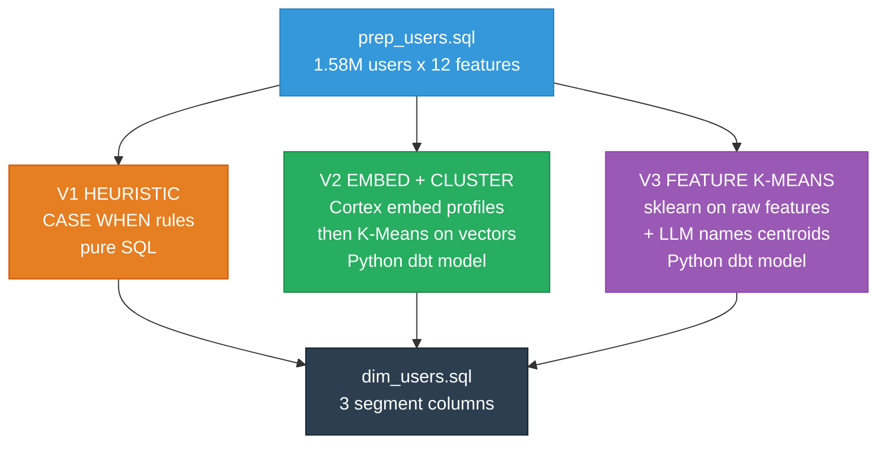

# Segmentation Architecture — Three Parallel Variants

> All three variants run in parallel from `prep_users`. Each produces `user_id → segment_name`. `dim_users` joins all three as separate dimension columns.

---

## Setup

```bash
# 1. Clone the repo
git clone https://github.com/umairtufail/snowflake-streaming-intelligence.git
cd snowflake-streaming-intelligence

# 2. Install tools (if not already)
brew install snowflakecli
pip install dbt-snowflake

# 3. Set up Snowflake CLI
mkdir -p ~/.snowflake
cp platforms/snowflake/connections.toml ~/.snowflake/connections.toml
# Edit ~/.snowflake/connections.toml → fill in your credentials
chmod 0600 ~/.snowflake/connections.toml
# Test: snow sql -q "SELECT 1" -c snowflake_conn

# 4. Set up dbt
cp .env.example .env
# Edit .env → fill in your Snowflake credentials
cd platforms/dbt/dbt_template
export $(cat ../../../.env | xargs)
dbt debug --profiles-dir .
# Should say "All checks passed!"

# 5. Build all models
dbt run --profiles-dir .
# Takes ~90s, builds 17 models
```

**Key files:**
- `platforms/snowflake/connections.toml` — Snowflake CLI config. Copy to `~/.snowflake/`, add your credentials.
- `platforms/dbt/dbt_template/profiles.yml` — dbt config. Reads `SNOWFLAKE_USER` and `SNOWFLAKE_PASSWORD` from env vars.
- `.env.example` → copy to `.env`, fill in credentials. `.env` is gitignored.
- `.user.yml` — auto-generated by dbt, gitignored.

---

## Verified Capabilities

| Capability | Status | Timing |
|:-----------|:-------|:-------|
| Cortex COMPLETE (LLM) | ✅ | Instant for 6 calls |
| Cortex EMBED_TEXT_768 | ✅ | 50K in 79s on XS warehouse |
| VECTOR_COSINE_SIMILARITY | ✅ | Works |
| sklearn via `PACKAGES` clause | ✅ | v1.8.0, need explicit `PACKAGES=('scikit-learn')` |
| Python dbt model | ✅ | Tested end-to-end, 52s for 1.58M users |
| Snowflake ML KMeans | ⚠️ | Works but doesn't auto-normalize → bad clusters without manual scaling |

---

## Overview



---

## V1: Heuristic — ✅ Done

**File**: `models/prep/prep_user_segments.sql`
**Approach**: Rule-based CASE WHEN on 6 behavioral features.
**Known issue**: 61% of users fall into Casual Scroller — thresholds can be tuned.

**Segments produced:**

| ID | Name | Rule |
|:---|:-----|:-----|
| 1 | Deal Hunter | High clickout rate + free/ads monetization |
| 2 | Cinephile | High avg IMDB + low genre entropy + 10+ events |
| 3 | Binge Curator | Many sessions + focused genres |
| 4 | Family Planner | High watchlist adds + family/animation genres |
| 5 | Omnivore | High genre entropy + many providers |
| 6 | Casual Scroller | Low event count |
| 7 | Mainstream | Default fallback |

---

## V3: Feature K-Means — ✅ Done

**File**: `models/prep/prep_user_segments_KMean.py`
**Approach**: Snowflake ML K-Means on 12 scaled features via a Python dbt model.
**Distribution**: 37/28/22/9/4% across 6 clusters. 52s runtime on XS warehouse.

**Features used:**
```
TOTAL_EVENTS, TOTAL_SESSIONS, TOTAL_CLICKOUTS, TOTAL_SEARCH_EVENTS,
TOTAL_WATCHLIST_ADDS, TOTAL_LIKES, DISTINCT_PROVIDERS, DISTINCT_GENRES,
AVG_IMDB_SCORE, CLICKOUT_RATE, SEARCH_RATE, GENRE_ENTROPY
```

**Still needed**: `prep_segment_profiles.sql` + `prep_segment_named.sql` for Cortex LLM naming.

---

## V2: Embed + Cluster

> Self-contained pipeline. Can be built independently.

### What it does

Converts each user's behavioral profile to natural language text → embeds with Cortex EMBED_TEXT_768 → K-Means on 768-dim vectors → LLM names each cluster.

### Why embeddings over raw K-Means

V3 clusters on 12 hand-picked numbers. V2 clusters on 768-dimensional semantic vectors. The embedding captures relationships that raw features miss — e.g., "free Action watcher" and "ads Thriller watcher" may be semantically closer than their raw numbers suggest.

### Pipeline

```
prep_users (1.58M rows)
    ↓
Step 1: prep_user_profiles_text.sql    — convert features to natural language
    ↓
Step 2: prep_user_embeddings.sql       — Cortex EMBED_TEXT_768 on profile text
    ↓
Step 3: prep_user_segments_embed.py    — K-Means on 768-dim vectors (Python dbt model)
    ↓
Step 4: prep_segment_profiles_embed.sql — centroid stats per cluster
    ↓
Step 5: prep_segment_named_embed.sql   — Cortex COMPLETE names each cluster
    ↓
dim_users.sql joins as segment_kmeans_name column
```

### Step 1: Text Profiles

**File**: `models/prep/prep_user_profiles_text.sql`

```sql
SELECT
    user_id,
    'Streaming user: clickout_rate=' || ROUND(COALESCE(clickout_rate, 0), 3)
    || ' (' || CASE
        WHEN clickout_rate > 0.1 THEN 'high'
        WHEN clickout_rate > 0.03 THEN 'medium'
        ELSE 'low' END || ')'
    || ', genre_entropy=' || ROUND(COALESCE(genre_entropy, 0), 2)
    || ' (' || CASE
        WHEN genre_entropy > 2 THEN 'very diverse'
        WHEN genre_entropy > 1 THEN 'moderate'
        ELSE 'specialist' END || ')'
    || ', avg_imdb=' || ROUND(COALESCE(avg_imdb_score, 0), 1) || '/10'
    || ', platforms=' || COALESCE(distinct_providers, 0)
    || ', primary_genre=' || COALESCE(primary_genre, 'unknown')
    || ', monetization=' || COALESCE(primary_monetization_type, 'unknown')
    || ', discovery=' || CASE
        WHEN search_rate > 0.1 THEN 'active_searcher'
        ELSE 'browser' END
    AS profile_text
FROM {{ ref('prep_users') }}
```

### Step 2: Embeddings

**File**: `models/prep/prep_user_embeddings.sql`

```sql
{{ config(materialized='table') }}

SELECT
    user_id,
    profile_text,
    SNOWFLAKE.CORTEX.EMBED_TEXT_768('e5-base-v2', profile_text) AS embedding
FROM {{ ref('prep_user_profiles_text') }}
```

Timing: ~10 min for 1.58M users on a Medium warehouse.

### Step 3: Cluster Embeddings

**File**: `models/prep/prep_user_segments_embed.py`

```python
def model(dbt, session):
    dbt.config(
        materialized="table",
        packages=["pandas", "scikit-learn", "numpy"],
    )

    embed_df = dbt.ref("prep_user_embeddings")
    df = embed_df.select("USER_ID", "EMBEDDING").to_pandas()

    import numpy as np
    from sklearn.cluster import KMeans
    from sklearn.preprocessing import StandardScaler

    X = np.stack(df["EMBEDDING"].values)
    X_scaled = StandardScaler().fit_transform(X)
    km = KMeans(n_clusters=6, random_state=42, n_init=10)
    df["CLUSTER_ID"] = km.fit_predict(X_scaled)

    session.use_schema("prep")
    return session.create_dataframe(df[["USER_ID", "CLUSTER_ID"]])
```

If `np.stack` fails on the VECTOR type, use:
```python
import json
X = np.array([json.loads(str(e)) for e in df["EMBEDDING"].values])
```

### Step 4: Profile Centroids

**File**: `models/prep/prep_segment_profiles_embed.sql`

```sql
SELECT
    e.cluster_id,
    COUNT(*) AS user_count,
    ROUND(COUNT(*) * 100.0 / SUM(COUNT(*)) OVER(), 1) AS user_pct,
    ROUND(AVG(u.clickout_rate), 4) AS avg_clickout_rate,
    ROUND(AVG(u.genre_entropy), 2) AS avg_genre_entropy,
    ROUND(AVG(u.avg_imdb_score), 2) AS avg_imdb_score,
    ROUND(AVG(u.distinct_providers), 1) AS avg_providers,
    ROUND(AVG(u.search_rate), 4) AS avg_search_rate,
    MODE(u.primary_genre) AS top_genre,
    MODE(u.primary_monetization_type) AS top_monetization
FROM {{ ref('prep_user_segments_embed') }} e
JOIN {{ ref('prep_users') }} u ON e.user_id = u.user_id
GROUP BY e.cluster_id
ORDER BY user_count DESC
```

### Step 5: LLM Naming

**File**: `models/prep/prep_segment_named_embed.sql`

```sql
WITH profiles AS (
    SELECT * FROM {{ ref('prep_segment_profiles_embed') }}
),
named AS (
    SELECT
        cluster_id,
        SNOWFLAKE.CORTEX.COMPLETE('llama3.1-70b',
            'Name this streaming audience segment in 2-3 words and describe it in one sentence. '
            || 'Stats: clickout_rate=' || avg_clickout_rate
            || ', genre_entropy=' || avg_genre_entropy
            || ', avg_imdb=' || avg_imdb_score
            || ', avg_platforms=' || avg_providers
            || ', search_rate=' || avg_search_rate
            || ', top_genre=' || top_genre
            || ', top_monetization=' || top_monetization
            || '. Format: Name: [name]\nDescription: [one sentence]'
        ) AS llm_output
    FROM profiles
)
SELECT
    e.user_id,
    e.cluster_id,
    TRIM(SPLIT_PART(SPLIT_PART(n.llm_output, 'Name:', 2), '\n', 1)) AS segment_name
FROM {{ ref('prep_user_segments_embed') }} e
JOIN named n ON e.cluster_id = n.cluster_id
```

### Verification

```bash
dbt run --select prep_user_profiles_text prep_user_embeddings prep_user_segments_embed prep_segment_profiles_embed prep_segment_named_embed

snow sql -q "SELECT cluster_id, COUNT(*) AS users FROM prep.prep_user_segments_embed GROUP BY 1 ORDER BY 2 DESC" -c snowflake_conn
snow sql -q "SELECT DISTINCT cluster_id, segment_name FROM prep.prep_segment_named_embed ORDER BY 1" -c snowflake_conn
```

### Troubleshooting

| Problem | Fix |
|:--------|:----|
| Embedding query times out | Use a Medium warehouse |
| Python model fails with schema error | Add `session.use_schema("prep")` before `create_dataframe` |
| VECTOR column can't be read as numpy | Use `json.loads(str(e))` to parse each vector |
| LLM naming is inconsistent | Re-run or hardcode names after first run |
| `PACKAGES` not found | Must be exact: `PACKAGES = ('pandas', 'scikit-learn', 'numpy')` |

### Time estimates (Medium warehouse)

| Step | Model | Estimate |
|:-----|:------|:---------|
| 1. Text profiles | SQL view | Instant |
| 2. Embeddings | SQL table (Cortex) | ~10 min |
| 3. Cluster | Python dbt | ~1-2 min |
| 4. Profiles | SQL table | Seconds |
| 5. Naming | SQL + Cortex | Seconds (6 LLM calls) |

---

## Build Status

| Model | Variant | Status |
|:------|:--------|:-------|
| `prep_user_segments.sql` | V1 Heuristic | ✅ Done |
| `prep_user_segments_KMean.py` | V3 K-Means | ✅ Done |
| `prep_segment_profiles.sql` | V3 | ⬜ TODO |
| `prep_segment_named.sql` | V3 | ⬜ TODO |
| `prep_user_profiles_text.sql` | V2 | ⬜ TODO |
| `prep_user_embeddings.sql` | V2 | ⬜ TODO |
| `prep_user_segments_embed.py` | V2 | ⬜ TODO |
| `prep_segment_profiles_embed.sql` | V2 | ⬜ TODO |
| `prep_segment_named_embed.sql` | V2 | ⬜ TODO |
| `dim_users.sql` | Mart | ⬜ Update to join all 3 variants |
